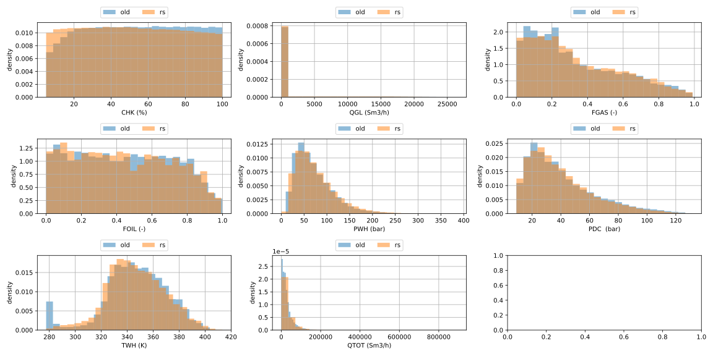
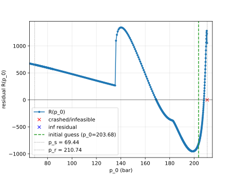
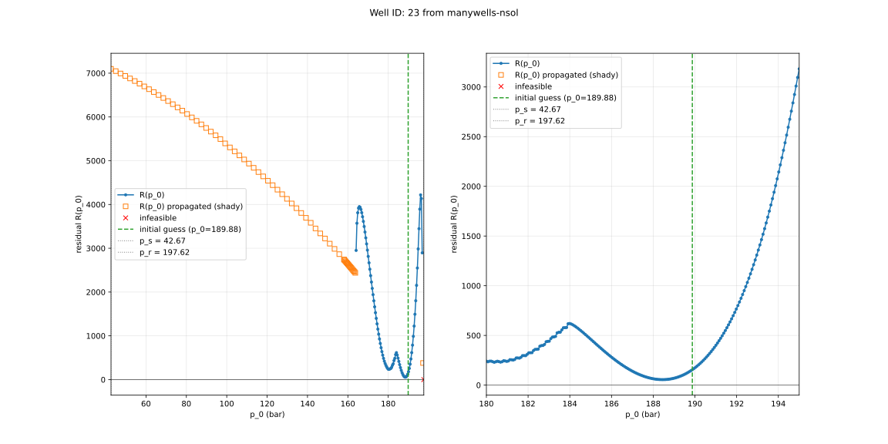

This file documents changes and additions I made for the rust simulator in additions to benchmarking, convergence tests and general thoughts.
In addition to this file, it might be useful to look through the notebook `notebook.ipynb`.

# Tutorial on how to simulate a well (with rust solver)

1. Read `simulate.md`.
2. Install the rust simulator (see [Installing the rust simulator](#installing-the-rust-simulator) below).
3. Swap the import: use `from manywells_rs import SSDFSimulator` instead of `from manywells.simulator import SSDFSimulator`. The rust `SSDFSimulator` accepts the ordinary `manywells` `WellProperties`/`BoundaryConditions` (and their inflow/choke models) directly. The one API difference is that `simulate()` returns a *list* of solutions (a well can have multiple steady operating points).

```python
# from manywells.simulator import SSDFSimulator
from manywells_rs import SSDFSimulator

sim = SSDFSimulator(well.wp, well.bc)   # plain manywells objects, no conversion
solutions = sim.simulate()             # list of solutions (>= 1), highest p0 first
df = sim.solution_as_df(solutions[0])  # highest-p0 operating point
```

# Installing the rust simulator

`manywells_rs` is a mixed Rust/Python package built with [maturin](https://www.maturin.rs/). Building it requires a Rust toolchain (`cargo`, e.g. via [rustup](https://rustup.rs/)) and the CPython development headers (`python3-dev` on Debian/Ubuntu).

From the repository root, with the project virtual environment active:

```bash
# One-time: install the build tool into the venv
uv pip install maturin

# Build the Rust extension and install manywells_rs into the active venv.
# `develop` gives an editable install: Python-side changes (the thin wrapper) are
# picked up without rebuilding, but re-run this after editing the Rust sources.
# Drop --release for faster, unoptimised debug builds.
cd manywells_rs
maturin develop --release
```

Verify the install:

```bash
python -c "from manywells_rs import SSDFSimulator; print(SSDFSimulator)"
```

# What has changed

1. The solver `manywells/simulator.py` offloads the system of non linear equations to
a NLP solver (CasADi with IPOPT). The rust solver does not setup a NLP, but solves the differential algebraic equation(s) using implicit Euler (with fixed point iterations for alpha) inside a single shooting loop for the bottomhole pressure instead. 
  - inspired by (manywells-masters)[https://github.com/oystebw/manywells-masters], but with a few changes:
    1. implicit Euler step the the momentum differential equation.
    2. analytic solution for temperature over the entire well
    3. root finding instead of predictor-corrector for the pressure in the next cell.
    4. fixed point iterations for alpha until convergence instead of 4 iterations.
2. cl_simulator adds a non zero objective function to the NLP. manywells_rs does not invoke a NLP solver, so this is not supported.

# Data sampling and convergence analysis

TODO: rerun this?

I ran `scripts/data_generation/open_loop_stationary/generate_well_data.py` and used the new rust simulator instead of the old one.
Below is a comparison of histograms of variables.



Noteworthy is the following:

1. The CHK distribution produced by the rust simulator does not "dip" towards 0% as it did for the old simulator.
2. The old simulator has a spike around 280K in the TWH distribution. rs does not have this.

# A note on multiple solutions (and simulator failures)

My rust solver uses a shooting method. The inflow model gives an equation that depends on the bottomhole pressure $p(z = 0)$.
Given a value $p_0 = p(z = 0)$, the solver integrates to the top of the well and computes the residual against the boundary condition at $z = L$.
Intuitivly: How far away is the predicted pressure at the well head from satisfying the choke model at the top of the well?
The first implementation of the integrator failed quite often due to "non physical" behaviour (or at least behaviour that the model does not satisfy the assumptions of the model). I observed the following:

1. pressure $p$ dropped below 0.
2. solving for alpha via the slip relation failed.
3. $p_u - p_s$ was negative, resulting in $\sqrt{2p_e(p_u-p_s)}$ failing in the Choke model.

Plotting $R(p0)$ over the domain $p0 \in (p_s, p_r)$ for `WELL_ID = 977` from `manywells-sol/manywells-sol-1_config`:


I tried to remedy this by "continuation" of the residual function.

1. If $p$ drop below $0$, mark the current integration as `failed` and propagate the current cell solution to the top 
2. If the root finder for $alpha$ fails, clamp it either to `1e-6` or `1 - 1e-6`, mark the current integration as `failed` and propagate the current cell solution to the top.
3. squaring the Choke model based on Bernoulli to ensure that we do not take square root of negative number.

This results in smoother `R(p0)`, making it easier for the shooting method to find a plausible solution.



NOTE: we need to make sure that this continuation does not lead to "false" solutions.
I handle this by only returning roots that has `failed = False` .

## example of multiple solutions:

`WELL_ID = 977` from `manywells-sol/manywells-sol-1_config`.

The old simulator finds this solutions:
```
               z           p       v_g       v_l     alpha       rho_g  \
0       0.000000  208.021807  0.429210  0.097178  0.293167  142.797996   
1      21.132954  206.487675  0.430413  0.097358  0.294469  141.769316   
2      42.265907  204.956395  0.431615  0.097534  0.295745  140.764535   
3      63.398861  203.427919  0.432816  0.097708  0.296999  139.781360   
4      84.531814  201.902206  0.434017  0.097880  0.298232  138.817718   
..           ...         ...       ...       ...       ...         ...   
96   2028.763537   74.266534  0.665380  0.121514  0.434723   62.119016   
97   2049.896490   73.053951  0.671485  0.121960  0.436792   61.262707   
98   2071.029444   71.846115  0.677775  0.122413  0.438876   60.405955   
99   2092.162397   70.643065  0.684256  0.122873  0.440977   59.548787   
100  2113.295351   69.444838  0.690936  0.123340  0.443094   58.691233   

          rho_l           T flow-regime  
0    989.499088  351.548861      bubbly  
1    989.499088  351.488266      bubbly  
2    989.499088  351.372013      bubbly  
3    989.499088  351.204634      bubbly  
4    989.499088  350.990293      bubbly  
..          ...         ...         ...  
96   989.499088  288.514422      bubbly  
97   989.499088  287.770629      bubbly  
98   989.499088  287.026821      bubbly  
99   989.499088  286.282998      bubbly  
100  989.499088  285.539162      bubbly  
```

whilst the rust simulator finds these two solution:

```
               z           p       v_g       v_l     alpha       rho_g  \
0       0.000000  208.022441  0.429155  0.097152  0.293135  142.798431   
1      21.132954  206.488292  0.430367  0.097333  0.294455  141.758223   
2      42.265907  204.957027  0.431576  0.097512  0.295746  140.743999   
3      63.398861  203.428593  0.432783  0.097687  0.297012  139.753181   
4      84.531814  201.902943  0.433990  0.097860  0.298256  138.783443   
..           ...         ...       ...       ...       ...         ...   
96   2028.763537   74.266742  0.665265  0.121479  0.434694   62.119453   
97   2049.896490   73.054105  0.671368  0.121926  0.436763   61.263108   
98   2071.029444   71.846217  0.677656  0.122379  0.438848   60.406319   
99   2092.162397   70.643114  0.684136  0.122838  0.440949   59.549114   
100  2113.295351   69.444835  0.690815  0.123306  0.443066   58.691521   

          rho_l           T flow-regime  
0    989.499088  351.548861      bubbly  
1    989.499088  351.516824      bubbly  
2    989.499088  351.424365      bubbly  
3    989.499088  351.276612      bubbly  
4    989.499088  351.078257      bubbly  
..          ...         ...         ...  
96   989.499088  288.513200      bubbly  
97   989.499088  287.769355      bubbly  
98   989.499088  287.025497      bubbly  
99   989.499088  286.281628      bubbly  
100  989.499088  285.537749      bubbly  

               z           p       v_g       v_l     alpha       rho_g  \
0       0.000000  168.986229  4.013033  2.120184  0.543670  116.001756   
1      21.132954  167.777605  4.031058  2.127009  0.545134  115.172853   
2      42.265907  166.571614  4.049242  2.133906  0.546604  114.347260   
3      63.398861  165.368256  4.067586  2.140877  0.548081  113.524937   
4      84.531814  164.167535  4.086092  2.147925  0.549564  112.705842   
..           ...         ...       ...       ...       ...         ...   
96   2028.763537   73.917781  5.803908  5.253332  0.815831   53.450548   
97   2049.896490   73.243796  5.839871  5.299558  0.817437   53.016993   
98   2071.029444   72.572492  5.876458  5.345992  0.819023   52.584900   
99   2092.162397   71.903802  5.913678  5.392660  0.820589   52.154213   
100  2113.295351   71.237665  5.951533  5.439604  0.822137   51.724879   

          rho_l           T flow-regime  
0    989.499088  351.548861  slug-churn  
1    989.499088  351.546524  slug-churn  
2    989.499088  351.539533  slug-churn  
3    989.499088  351.527917  slug-churn  
4    989.499088  351.511706  slug-churn  
..          ...         ...         ...  
96   989.499088  333.730347     annular  
97   989.499088  333.391632     annular  
98   989.499088  333.050374     annular  
99   989.499088  332.706589     annular  
100  989.499088  332.360293     annular  
```

If I set the initial guess for p0 to be closer to the other solution, CasADi returns the same solution as the rust simulator.

Questions: 
Can this explain the different behaviour in CHK and TWH noted above?
Is there any physical reason for why we find multiple solutions?

## The root finder

By inspecting plots of residuals, they all seem to dip below 0 for `p0` pretty close to `p_r` and then rise
again in a 'U' shape. I assume that the residual function have this shape for the outer shooting loop.

## Simulator failures

For some well configurations, a simulator failure is "correct". There is no bottomhole pressure that satisfies the choke model at the well head.
Take a look at this residual plot:



Both the rust simulator and the old one fails in this case.

# Benchmarking

`scripts/compare_simulators.py` may be ran with the `benchmark` command.

Results from running it on my Lenovo Yoga Slim 7 14IMH9 with an Intel(R) Core(TM) Ultra 7 155H cpu:

```
/home/oskar/manywells/data/manywells-nscl/manywells-nscl-1_config.zip
  simulator     wells  success   fail   total(s)   mean(s)  median(s)    max(s)
  rust           2000     1970     30     17.863    0.0089     0.0081    0.0916
  simulator      2000     1304    696   1556.988    0.7785     0.8123    9.0208

/home/oskar/manywells/data/manywells-nsol/manywells-nsol-1_config.zip
  simulator     wells  success   fail   total(s)   mean(s)  median(s)    max(s)
  rust           2000     1980     20     16.760    0.0084     0.0079    0.0815
  simulator      2000     1363    637   1613.571    0.8068     0.8310    2.9358

/home/oskar/manywells/data/manywells-sol/manywells-sol-1_config.zip
  simulator     wells  success   fail   total(s)   mean(s)  median(s)    max(s)
  rust           2000     2000      0     10.620    0.0053     0.0052    0.0204
  simulator      2000     1997      3   1799.073    0.8995     0.8630    2.4404

Overall
  simulator     wells  success   fail   total(s)  mean/well(s)  speedup
  rust           6000     5950     50     45.242        0.0075   109.8x
  simulator      6000     4664   1336   4969.632        0.8283     1.0x
```

# Tests

I copied over the relevant tests from the `develop` branch into the rust version.
Run `cargo test` to run the tests. You might need to install `python3-dev` to make this work.
Also, since the rust project is it's own "thing", having the main `manywells` environment activated may cause issues.

# How does it compare to the develop branch

I intentionally tailored the new solver to solve the original DAE (differential algebraic equations) from the paper.
It might or might not be easy to incoorperate additions and modifications of the model into the solver due to:

1. it is not formulated as an NLP
2. the temperature profile is integrated analytically over the entire well given the initial condition $T(z=0) = T_r$.
3. numerical integration is done by solving two equations with a root finding method:
  - the slip relation for $\alpha$
  - and then the discretized momentum equation for $p$.

# Further work / ideas

Just writing down some thoughts:

1. Can we use a DAE solver instead? This would also directly support adding time into the equations.

2. https://www.sintef.no/globalassets/project/co2-dynamics/publications/lund_two-phase_relaxation_hierarchy.pdf

3. Newton-Krylov + implicit time integration?
  - https://www.sciencedirect.com/science/article/abs/pii/S0306454917303766

4. Instead of using NLP solver, maybe using some numerical non linear solver like JFNK directly?

5. How much work is needed to add time dependence to the equations? The energy balance is the tricky one I think.

